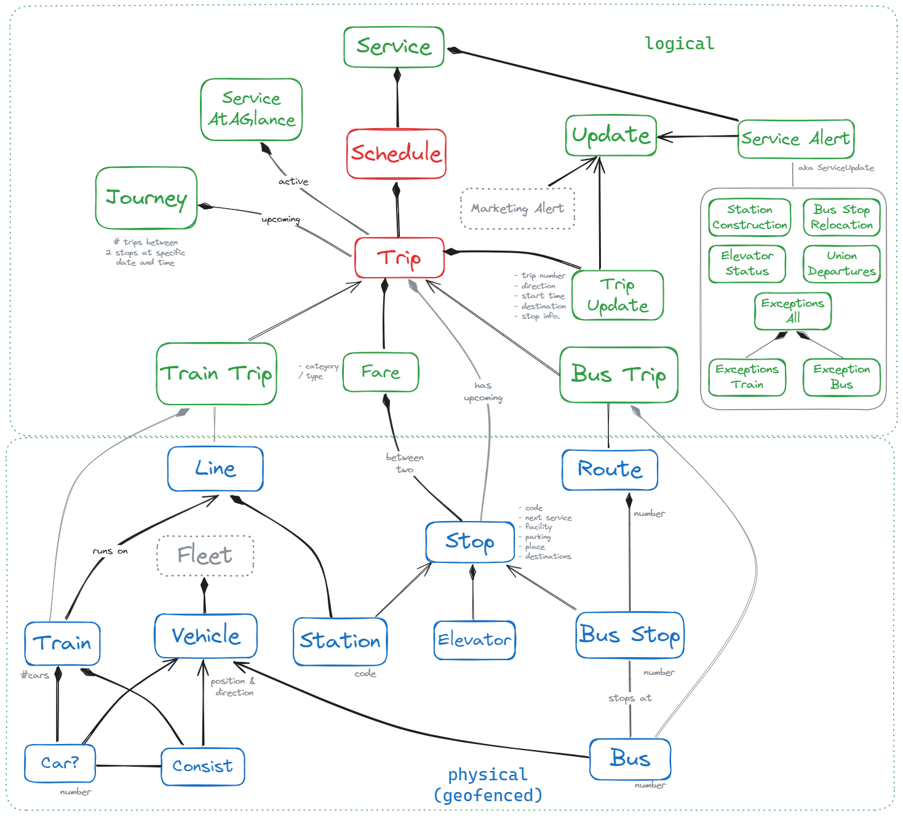

# go_cli

A command line interface to lookup train information.

## Disclaimers

1. This is not ready to be used by anyone
2. It does not (yet?) use the python Open API library
3. This is a personal project, not affiliated with any organization, suggest you go and use the Open APIs

## Some context

Uses [Open Data - GO API](http://api.openmetrolinx.com/OpenDataAPI/Help/Index/en) and that page links to the [API Specification](http://api.openmetrolinx.com/OpenDataAPI/Content/API_Data_Catalogue.pdf).

## Before you start

You'll need to [request an Open API key from Metrolinx](http://api.openmetrolinx.com/OpenDataAPI/) which only took a couple of days to receive via email.

### Dependencies

This code imports from the following pacakges so make sure you install those first.

- `requests` - to make REST calls
- `argparse` - to parse command line arguments
- `json` - to parsing response bodies

## Options

Option | Description
---|---
`-k` | Your GO API key. See the "Before you start" section.
`-s` | The Bus Stop or Train Station being queried e.g. "AP" for Appleby. See [go_api.py](./go_api.py) for the list of station codes.

## Mock diagram

## Things to look at

1. https://data.ontario.ca/dataset/ontario-railway-network-orwn
1. https://data.ontario.ca/dataset/ontario-road-network-road-net-element
1. https://data.ontario.ca/dataset/go-train-stations
1. 